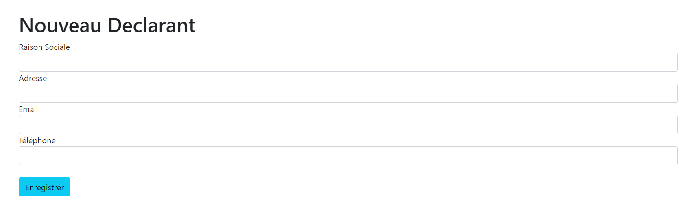

##                     Mise en Place d’un Système de Régularisation des Impôts 

### Formulaire d'Ajout d'un Declarant

### Formulaire d'Ajout d'une Declaration

### Ajout Paiement d'une Declaration

### Détails des Paiements d'une Declaration

### Liste des Declarants

### Liste des Declarations

### Mettre à jour Declarant

### Verification des Montants pour ne pas que le montant des paiements soit supperieur au montant de la déclaration

